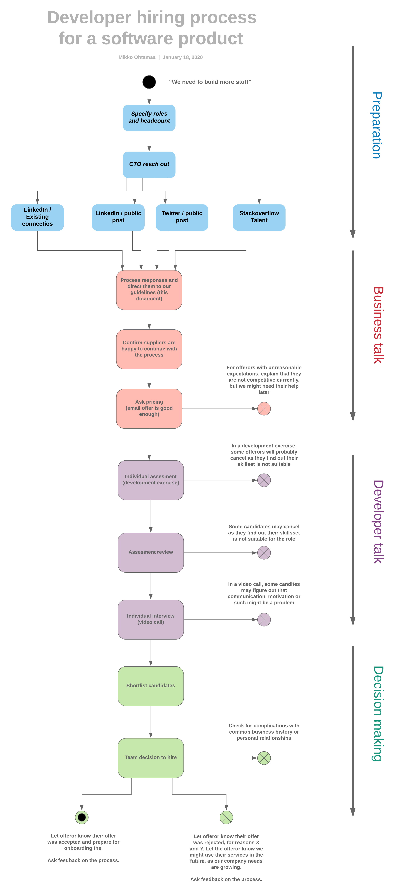

# How to hire developers

This document outlines my process for hiring remote developers for an existing software product and team. 
The purpose of this document is to help manage expectations with both business people and developers.
I want to make my process understandable and communicate not just my actions, but my intent,
so that there are more positive suggestions and fewer disappointments on both sides of the table. 

I hope my memo also serves as an inspiration for other companies who look to acquire 
the top developers of the world for remote work.

- [Hires for an existing software product](#hires-for-an-existing-software-product)
- [What is talent and where to find it](#what-is-talent-and-where-to-find-it)
- [Hiring remote workers and outsourced developers](#hiring-remote-workers-and-outsourced-developers)
- [Business talk](#business-talk)
  * [Types of offerors](#types-of-offerors)
  * [Asking the price](#asking-the-price)
  * [Other factors](#other-factors)
- [Developer talk](#developer-talk)
  * [Individual assessment](#individual-assessment)
  * [Individual interview](#individual-interview)
- [Decision making](#decision-making)
  * [Shortlisting](#shortlisting)
  * [Decision to hire](#decision-to-hire)
    + [Polite replies and good business practices](#polite-replies-and-good-business-practices)
    + [Always ask for feedback](#always-ask-for-feedback)

# The process

Overview of my process:

# Hires for an existing software product

In the process I lay out here, we are hiring developers for existing product development.

* The current company and its management is well-versed in their product and industry vertical, 
  thus there is no need to shop for a solution, as we are the best people in the world
  to tell what that solution is

* There is no set end date for the contract, as there would be with a project-based work,
  as software products live forever

* An existing company has its existing developer culture and workflows

Specifically, I am not

* Looking for solution providers 

* Looking to something that comes with added project management or quality
  controls - as it is with some outsourcing shops that you need
  to have a local boss to overview employees

* Looking for people who do not directly communicate with me or the team,
  or have any kind of intermediates, like local bosses

# What is talent and where to find it

Quality over quantity. 

In software development, up to a certain organisation size, 
it makes sense to get the best developers even if you need to pay a daring premium for it. 
This is because in software development productivity scales faster than compensation. 
There exist a myth of 20x performers.  In real life, the performance of a senior, enthusiastic expert is 3x - 4x and the compensation 2x-3x, 
but it is still a good business trade-off to be made.

To get the best developers, you need to make sure 

1. The best developers know you exist and find you

2. Your organisation is seen as exciting and a fun place to work,
   as better you become more picky you can be with your choices

3. Developers get feeling the team is expert in what are doing,
  as when experts work with other experts, there are high expectations,
  less friction and high satisfaction of doing challenging deliveries 

This memo you are reading is also partially advertisement for points 1. and 2. - 
I want to set high expectations for myself and people contacting me, so that they will go to an extra effort
to create a quality relationship. 

I want to make the hiring process as open and wide-reaching as possible,
and be able to process high number of candidates efficiently. 
Partly because you never know where the good talent lurks, partly
because I believe into democratising opportunites, partly because
it is how I bootstrapped my career and I want to give others
the same chances. More about this below. 
  
# Hiring remote workers and outsourced developers

The fact that anyone who can access a laptop and internet can be a software developer 
makes it is a rare value proposition.
It is very democratic and meritocratic in the sense that as long as you can be online,
you can learn it and you can find work. The rest is up to you: how hard you 
push to learn and work. Well-known software company success stories like 
Github, Ubuntu and 37 Signals (Basecamp) were built on 100% remote teams. 

I also dare to claim that to find the top talent, rock star developers or
20x performers, however you want to call them, it makes sense to go beyond
my shoreline. Rockstars might not live next door - 
to build a good developer organisation we need to be able to board people from anywhere, 
no matter what is their background.

# CTO reach out

If you are a talented developer and manager yourself, you are active in the developer
community forums. You have audience and followship. This makes
it easy to reach out for potential offerors how can provide candidates for the work. 
You can find and judge potential candidates yourself, you do not 
need to rely external help. Your incentives to hire
are aligned with the business.

## Types of offerors

# Business talk

When you hiring contractors or employees, you can source developers primarily three ways

* Direct hires, employees or freelancers 

* Through an outsourcing agency

* Through a recruitment agency 

I do not discriminate how the 

The main difference between recruitment and outsourcing agencies is how they are compensated.

The recruitment agency takes a one-time bonus for making the hire. Their specialty is the distribution
network, or wide reach for the offer ad. The traditional recruitment agencies usually have little or no
insight into the quality of candidates, although there exist nowadays more specialised platforms
to cater the hiring of the software development world. 

Outsourcing agencies price their margin in the hourly or monthly compensation of the developer.
The outsourcing agency maintains the corporate structure for the developer. 
They do more long term commitments and also can offer usually more than 
one individual developer. The margin with outsourcing agencies vs. paying direct
salary varies between 25% - 50%, so it might be a little bit expensive in the long run.

Freelancers, or individuals, take care of themselves. There is the least overhead working
with people directly.  

## Frequently asked questions for offerors

The offerors, business people usually need to understand the scope of the work.
There will be frequently asked questions, so it makes sense
to have frequently pasted answers, like

* We will shortlist at least five different candidates before making a decision and
  we expect this to take 2-3 weeks after the first assessments and interviews

* The work is for a live, ongoing product, and there is no final delivery or scoped project

* There is an in-house project management and quality assurance	

* Developers would integrate part of the existing team and culture

* Please be able to travel: A bootstrap camp of 2 weeks with other developers in Europe in some point might be nice,
  so that people get to know each other and build a better understanding of personalities

* The team is 15 people now, of which 10 work directly on the product as developers or managers
  
## Asking the price

I will ask the price before engaging to the further discussion. This is 
because usually you first deal with business people before you can
deal with developers themselves. Furthermore, if the expectations
of the offerors are unrealistic, it is polite not to waste anyone's 
time. 

As our organisation can work with any developers around the world, it means
we can very effectively exploit disparities in the global wealth distribution.
Hiring people from low-income countries is naturally cost-efficient,
as these people need less money for their everyday life.  

However, this does not mean developed countries are automatically excluded.
It makes sense to get the initial offer, or price, from anyone. You might
find surprises. Scottland is not expensive as London and Lapland
is not expensive as Helsinki. Also, if the developer is really really
good, I am happy to pay 5x premium for 20x productivity. 

Also, there are very motivated, very talented people, who are still making
their way to the working life. I started my freelancer career as 
doing remote hours for a London based education company from Finland,
only for few thousands dollars per month, which was very competitive rate.
Regardless, I was young, but still world class developers and the arrangement
suited for my life situation - local companies could pay me little bit more,
but I would have needed to work with Nokia's software supplier and
code C++ for Symbian platform, a horror with frustrations and motivation. 

## Other factors

Besides price and skill, there are other factors that may affect the recruitment process.
Even if one does not think about them, they should be made explicit
so that they are quantified when talking with offerors.

* Common history - You have worked with some people
  before and you share the scars of the same war

* Existing trust relationship - a personal recommendation
  from a party you trust

* Access to wider knowledge pool - often 
  outsourcing agencies tout that they can give you access
  to expertise beyond the individual being hired 

* Transactional cost - when you open new business relationships,
  there is always a transaction cost with an introduction call,
  sharing information, making yourself available  

* Ability to travel - I want to meet all people I work with 
  face-to-face some point. Potentially, I want to organise
  at least one week-long sprint every quarter where
  most of the team gathers to the same place. 
  Spending face time always increases productivity and 
  makes people feel better about themselves.

# Developer talk

If the offers are not outrageous, then it comes down to judge 
how good people's skills are and how to pick. 

Some factors to consider

* **Domain specific knowledge**: 
 Even though a good developer can learn any new technology,
 for a startup companies time-to-market is important. 
 The HR resources that can be invested to training are scarce.
 Thus, it makes sense to prefer developers with knowledge
 of the existing development stack. 

* **Expressing yourself** Basic communication skills are must. Vocal English is 
  less important than written English. Besides be able
  to understand English as a language, one need to be 
  able to express themselves. This means having
  the clarity in pull request comments, 
  able to ask help in Slack, and so on. Sometimes
  this is connected to cultural issues, but
  I myself am a believer of global software
  development elite culture, where anyone
  who is excited to explore and interact with other projects in
  Github picks this up fast.

* **Honesty** This one is a big bummer for me, as I come
  from one of the most trustful and transparent nations in the world. 
  In a global business, do not take people's word granted. They will 
  oversell, they can be desperate and they may not have 
  moral qualms about lying. Trust, but verify. 

## Individual assessment 

To scale my hiring process, be open and reach as many good candidates as possible,
I will make all candidates undergo small exercises that 
reflect the actual domain specific work they do.

* I respect people's time and make the exercises so small that if you are a
  domain expert you should be able to complete it in 5 - 15 minutes

* This is not code-golf. I prefer practical skills over theoretical computer 
  research. I am hiring for building applications, not infrastructure
  like databases. All programming languages we work will include `sort()` function, 
  so you do not need to write it. 

* I want to people comment their code, use Github, make a pull request and see how their
  communication skills are. 

Example of individual assessment:

* **Frontend**: I noticed the sign-up page has some extra scroll 
  on mobile. Can you fix it? Also, the signup page looks like dog shit, as it was quickly gobbled
  together. Can you make it little bit prettier while you are poking around the stylesheets?... 

* **Frontend**: Looks like the signup form email input is case sensitive. Users
  are having issues when they try to sign in `Dog@example.com` and `dog@example.com`.
  Can you fix this and write browser automated functional test to see that this does not happen 
  in the future?...

* **Backend**: The rest API gives HTTP 500 when you submit a signup with an underscore 
  in the email. Can you fix this? Also please let me know if there are other problems
  in the signup, as I gobbled it together last-minute before the launch and it 
  has not received enough love. 

..Here is the Github repository with README. Please install the local development environment 
as stated in README and submit the pull request. 
add them to the pull request - if you are smarter than me you get some extra point. 
Also if you have any other suggestions, please 

I expect that people who do not possess enough domain expertise drop in this step. 
I do not expect low quality submissions, but people who push their luck despite
having no expertise should be easily spot due to funny coding style, improper 
code formatting and such lack of basic software development best practices. 

## Individual interview

I will have a video call with every candidate who passes the basic assessment.
I hope to have assessment before the call, as reviewing the assessment
takes probably only 1-5 minutes of my time, versus having a call I need
to book a slot of 30 minutes in my calendar. 

In the interview, I try to gouge not only the basic communication skills,
but also the passion the person shares with the fellow developers.

Coming from the open source consultancy background, I know I can
value the following merits

* Participated in open source projects, through issues, pull request
  or even maintaining one. This means that you are passionate
  about the technology you work with. It is also a public
  track record and easy to verify.

* Helped others on Stackoverflow or similar forum 
  by posting questions and answers. It shows that one
  is helpful and can behave. Also, this is easy to verify.

Also. I want to try to verify if the candidate is suitable for remote
working   

* Need to be able to pull overlapping working hours with the team - 
  usually with e.g. Indians this happens by people in India shifting their
  working hours to match the Western business hours 
  
* Need to be able to work independently - do not stop if you encounter 
  an issue, but make sure you proactively ask for help and report
  you cannot continue

* Need to be motivated - even if there are people not watching you 
  or socialising you, you can focus on work and do not wander 
  off to social media

# Decision making

## Shortlisting

Based on the business talk and developer talk funnel, I can stop 
the hiring process when I have 5 - 10 candidates. I expect this
to take 2-3 weeks. I could take the shortcut and just hire the 
first candidate with reasonable price available, but it does
not make sense to be in such a hurry - after all quality over
quantity and you might come across somebody special 
who you are keen to work with.

It is a team decision to hire. Though my voice is very decisive,
I also need to hear the voices of business management and others. 
Some complications may surface in this point, e.g. someone
having a bad experience with a particular outsourcing agency in the past.

## Decision to hire

After the decision has been might, we will engage
to the contract signing process. 

### Polite replies and good business practices

Other candidates and offerors who were not picked
are let to know what led to this decision. Always keep the
business relationship good and warm, as sometimes incidents
do happen post decision making and you need to 
take steps backwards and go 
back to the shortlist.  

### Always ask for feedback

Also, I want always to collect feedback. Even if the offerors
did not like the process, I want to hear them out. 
I am not perfect, my process is not perfect, I am not an HR 
expert but a mere hacker with Masters in management. 
There are people smarter than me out there and if
they offer me feedback, I will appreciate and see
if I can do something in return.

# Miscancellous

Table of contents courtesy of [Markdown TOC](https://ecotrust-canada.github.io/markdown-toc/).

